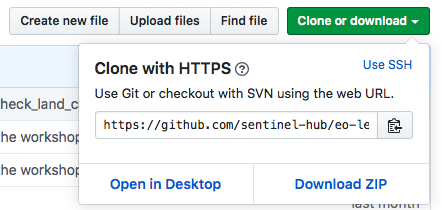
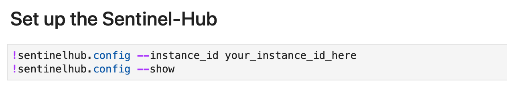

# Aqua_Cyder (Bridging Earth Observation data and Machine Learning in Python)

 [](https://mybinder.org/v2/gh/cyder-water-extraction/NEERI_AquaCyder/master)


## Description


The availability of open Earth observation (EO) data through the Copernicus and Landsat programs, as well as plethora of commercially available satellite imagery, represents an unprecedented resource for many EO applications, ranging from ocean and land use/land cover monitoring to disaster control, emergency services and humanitarian relief. Large amounts of such spatiotemporal data call for tools that are able to automatically extract complex patterns embedded inside.

`eo-learn` is a collection of open source Python packages that have been developed to seamlessly access and process spatio-temporal satellite imagery in a timely and automatic manner. It makes the extraction of valuable information from satellite imagery as easy as defining a sequence of operations to be performed on satellite imagery. It also encourages collaboration --- the tasks and workflows can be shared, thus allowing for community-driven ways to exploit EO data.

The `eo-learn` library acts as a bridge between the Earth Observation (EO)/Remote Sensing (RS) field and the Python ecosystem for data science and machine learning. It lowers the entry barrier to the field of RS for non-experts and simultaneously brings the state-of-the-art tools for computer vision, machine learning, and deep learning existing in Python ecosystem to remote sensing experts.

`AquaCyder` aims on tasks like dealing with retrieving the EO data (e.g. Sentinel-2), processing it, adding non-EO data (e.g. labels) to the dataset etc. and finally build the whole pipeline to run such workflow thus preparing the data for ML algorithms for all the water bodies in INDIA, using `eo-learn` framework


# Installation notes

## 1) Open AquaCyder just with your browser-

You can use the "launch binder" link above at the top of this README, which will launch a notebook instance on Binder with all required libraries installed.


## 2) Run on your own computer

 **Running on pip environment**  
The minimal requirements are
 + eo-learn (please see [installation instructions](https://eo-learn.readthedocs.io/en/latest/install.html))
 + [jupyter](https://jupyter.org/install)

At the moment the recommended way is using a virtual environment (`venv`, i.e. `python3.6 -m venv AquaCyder`) or `pipenv` Installing with `conda` might prove problematic. On Linux it is recommended to install system packages from  [CI build instructions](https://github.com/sentinel-hub/eo-learn/blob/master/.travis.yml#L12) first.

- **Running on conda environment**  
 Alternatively,download this repository and create a new conda environment using the provided environment.yml file:

```
conda env create --name AquaCyder --file environment.yml
conda activate AquaCyder
```





## Setting up your Sentinel Hub account


It is possible to run the `AquaCyder` using your own Sentinel-Hub credentials. In order to do that, there are a few instructions you have to follow:

* if you don't have a Sentinel Hub account, you can create a trial account for free [here](https://www.sentinel-hub.com/trial)
* once you have the account set up, login to Sentinel Hub [Configurator](https://apps.sentinel-hub.com/configurator/). By default you will already have the default confoguration with an instance ID (alpha-numeric code of length 36). For these examples it is recommended that you create a new configuration ("Add new configuration") and set the configuration to be based on `Python Scripts template`. The configuration already contains all layers used in this workshop. 
* insert the `instanceId` into the first cell of `Water_Level_Extraction.ipynb` notebook, as shown here:


## Access `AquaCyder` using frontend

`AquaCyder` can be intergrated and acessed with an Anvil-Uplink based UI. Navigate to `Frontend/` directory for further details

## Authors

Interns at CSIR-NATIONAL ENVIRONMENTAL ENGINEERING RESEARCH INSTITUTE, NAGPUR
